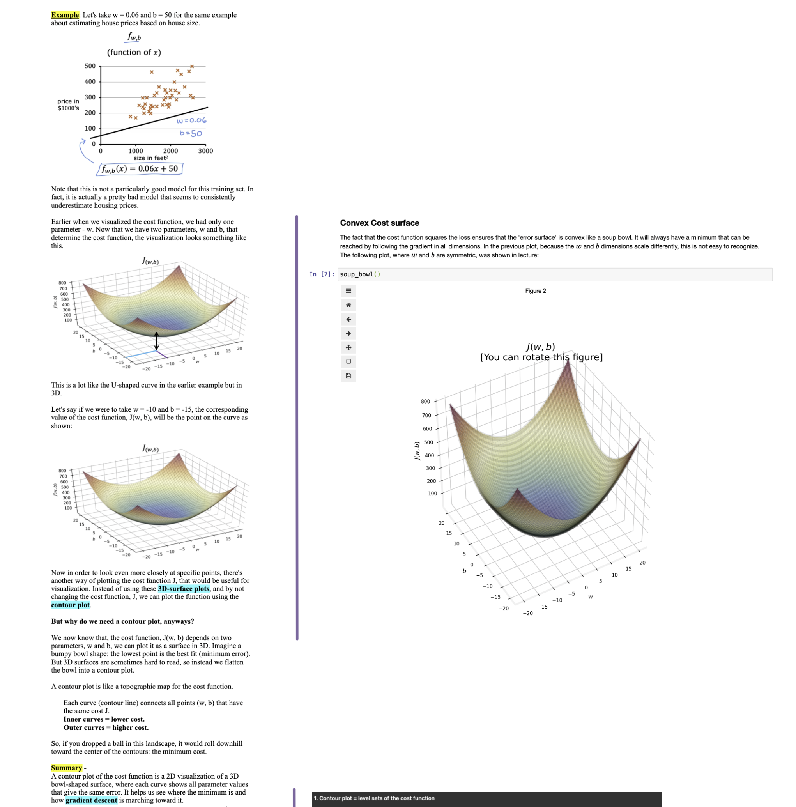
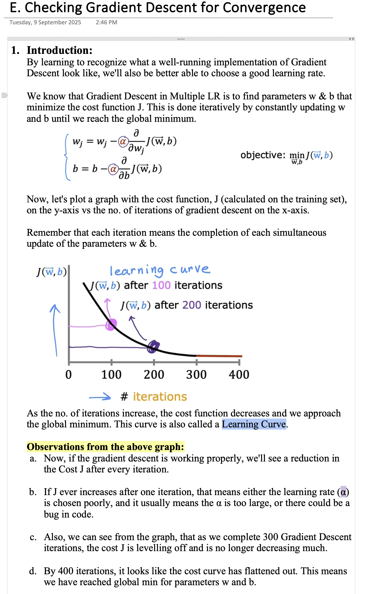

# Linear Regression Notes Complete

A growing collection of my personal notes exploring linear regression fundamentals—from univariate to multivariate concepts. This repo is a living document: I’ll keep updating it as I unpack new ideas, methods, and examples.

## What's Inside
- **Univariate Linear Regression** — Simple one-variable relationships.
- **Multiple Linear Regression** — Extending to multiple predictors.

## Sample Image
**1. Contour Plot Explanation (image on left)**  
**2. Checking Gradient Descent for Convergence (image on right)**

  
  

## Sources & Credits
These notes are a blend of:
- **Machine Learning Specialization (DeepLearning.ai)** — structured course material.  
- **Geeks for Geeks** — reference articles and explanations.  
- **My personal notes** — reflections, derivations, and worked examples.  

## How to Use It
- Browse the notes directly on GitHub.
- Clone the repo to explore and run any examples locally.
- Expect updates frequently; check back for new insights.

---

*Hope it helps.*
